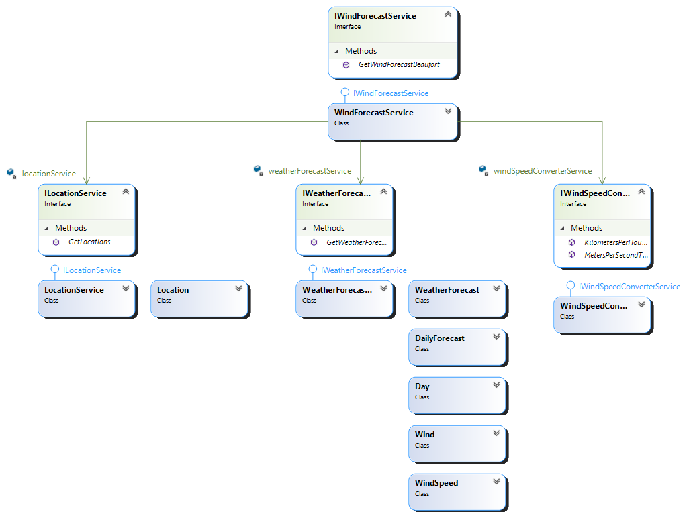

# Wind Forecast

In this kata you implement the Gang Of Four Facade Pattern [[1](#ref-1), [2](#ref-2), [3](#ref-3)].

## Problem Description

An application shall provide the wind forecast in beaufort for a particular day at a given location.

## Intended Design

Use the Facade pattern to hide the different APIs with their special value objects. An implementation may look as depicted here. The number of value objects per service depends on the acutal service provider you choose.

| Class(es) | Description
| --------- | -----------
| `WindForecastService` | This Facade hides the underlying services and associated data types
| `LocationService`, `Location` | Client class and associated value object to call an HTTP service providing location information associated with a search string
| `WeatherForecastService`, `WeatherForecast`, `DailyForecast`, `Day`, `Wind`, `WindSpeed` | Client class and associated value objects to call an HTTP service providing the daily weather forecast for a location
| `WindSpeedConverter` | Provides methods to convert wind speed from m/s to Beaufort and from km/h to Beaufort, respectively

For every non-value object, an interface allows to create mocks for tests.

### Background information

You can do this kata with simulated data. If you prefer this approach, then please download the interfaces [ILocationService](kata-gof-pattern-facade-windforecast/AccuWeather/LocationApi/ILocationService.cs) and [IWeatherService](kata-gof-pattern-facade-windforecast/AccuWeather/WeatherForecastApi/IWeatherForecastService.cs) from this repository and the associated data classes. Use a mocking framework like [Moq](https://github.com/Moq/moq4/wiki/Quickstart) in order to provide simulated data to your tests.

If you would like to play with real data, then you need API keys for two services: one service shall provide geolocation information, the other shall provide a weather forecast based on the geolocation.

The following services can be used in a trial version free of charge and are covered by the code in this demo:

| Geolocation | Weather forecast | Sign up for trial API keys
| ----------- | ---------------- | --------------------------
| [AccuWeather API](https://developer.accuweather.com/packages) [[4](#ref-4)] | [AccuWeather API](https://developer.accuweather.com/packages) [[4](#ref-4)] | [Register for AccuWeather API (Limited Trial, free of charge)](https://developer.accuweather.com/user/register) [[5](#ref-5)]
| [Bing Maps API](https://docs.microsoft.com/en-us/bingmaps/rest-services/) [[6](#ref-6)] | [OpenWeather API](https://openweathermap.org/api) [[7](#ref-7)] | [Register for a Bing Maps Key](https://docs.microsoft.com/en-us/bingmaps/getting-started/bing-maps-dev-center-help/getting-a-bing-maps-key) [[8](#ref-8)], [Register for OpenWeather API](https://home.openweathermap.org/users/sign_up) [[9](#ref-9)]

Additional helpful information can be found here:
  * [Wind speed units & wind directions](https://www.windfinder.com/wind/windspeed.htm?) [[10](#ref-10)]
  * [Unix Epoch to Human Readable Date Converter](https://www.epochconverter.com/) [[11](#ref-11)]

### Note on the solution in this repository

This solution expects that you have API keys for all APIs mentioned above. Please store the keys in environment variables before launching your IDE or test runner:

| Variable | API
| -------- | ---
| `ACCUWEATHER_APIKEY` | [AccuWeather API](https://developer.accuweather.com/packages) [[4](#ref-4)]
| `BINGMAPS_APIKEY` | [Bing Maps API](https://docs.microsoft.com/en-us/bingmaps/rest-services/) [[6](#ref-6)] 
| `OPENWEATHER_APIKEY` | [OpenWeather API](https://openweathermap.org/api) [[7](#ref-7)]

## Hints

- Keep the implementation as minimal as possible in order to keep the kata small. Just fulfill the requirements
- Use TDD. Tests first. Red, Green, Refactor.

## Minimum number of steps to implement the kata

1. Create a class which calls your weather forecast provider (REST API or mock) and returns the daily windspeed forecast for an arbitrary location.

2. Allow customizing the forecast location by passing location related parameters to the class created above.

3. Create a class to transform m/s wind speed to beaufort. Use the table below as a reference and see also [Wind speed units & wind directions](https://www.windfinder.com/wind/windspeed.htm?) [[8](#ref-8)].

4. Create a class which calls your location provider (REST API or mock) and returns location information associated with a search string. Calling the class method with the parameter "Amsterdam NL" should result in the location parameter(s) required for step 2 above.

5. Extend your wind forecast class such that it returns the wind speed for the nth day in the future. E.g. if you pass the value `daysFromNow = 1` the wind forecast for tomorrow shall be returned.

6. Create a Facade class `WindForecastService`. The method `GetWindForecast(string location, int daysFromToday)`. The location parameter shall be a location search string (see step 4), the daysFromToday parameter shall be the integer number of days from today for which a wind speed forcast shall be returned. The method shall return the wind speed in beaufort expected at the `location` at the time `today + daysFromNow`.

## Kata Extension

The following steps show how you can get into more details about the kata. Each step is optional.

7. Handle edge cases like wrong API key(s) passed to the REST API, invalid number of daysFromNow (e.g. your service only allows to read 5 days while the user requested a forecast for 10 days), location not found etc.

8. Use the same facade as created in step 6 and connect it to a different set of location and weather forecast providers. E.g. replace the BingMaps / OpenWeather API backend by AccuWeather API. Rewrite the test for step 6 such that it can be used for any facade implementation.

## Finishing Touches

- Avoid duplicated code (use `tools\dupfinder.bat`).
- Fix all static code analysis warnings.
- Check the Cyclomatic Complexity of your source code files. For me, the most complex class has a value of (7 - AccuWeather.WindForecastService) and the most complex methods have a value of (3 - GetWindForecastBeaufort in both WindForecastService classes). See Visual Studio -> Analyze -> Calculate Code Metrics.

## Appendix

### Windspeed: m/s to beaufort conversion

Source: [Windfinder: Wind speed units & wind directions](https://www.windfinder.com/wind/windspeed.htm?) [[10](#ref-10)]

Beaufort | Knots | m/s | km/h | mph | Label
-------- | ----- | --- | ---- | --- | -----
0 | 1 | 0 - 0.2 | 1 | 1 | Calm
1 | 1-3 | 0.3-1.5 | 1-5 | 1-3 | Light Air
2 | 4-6 | 1.6-3.3 | 6-11 | 4-7 | Light Breeze
3 | 7-10 | 3.4-5.4 | 12-19 | 8-12 | Gentle Breeze
4 | 11-15 | 5.5-7.9 | 20-28 | 13-17 | Moderate Breeze
5 | 16-21 | 8.0-10.7 | 29-38 | 18-24 | Fresh Breeze
6 | 22-27 | 10.8-13.8 | 39-49 | 25-30 | strong Breeze
7 | 28-33 | 13.9-17.1 | 50-61 | 31-38 | Near Gale
8 | 34-40 | 17.2-20.7 | 62-74 | 39-46 | Gale
9 | 41-47 | 20.8-24.4 | 75-88 | 47-54 | Severe Gale
10 | 48-55 | 24.5-28.4 | 89-102 | 55-63 | Strong storm
11 | 56-63 | 28.5-32.6 | 103-117 | 64-73 | Violent Storm
12 | 64-71 | >32.7 | >118 | >74 | Hurricane

## References

<a name="ref-1">[1]</a> David Starr and others: "Facade" in "Pluralsight: Design Patterns Library", https://www.pluralsight.com/courses/patterns-library, last visited on Jun. 2, 2020.

<a name="ref-2">[2]</a> Erich Gamma, Richard Helm, Ralph Johnson, John Vlissides: "Design Patterns: Elements of Reusable Object-Oriented Software", Addison Wesley, 1994, pp. 151ff, [ISBN 0-201-63361-2](https://en.wikipedia.org/wiki/Special:BookSources/0-201-63361-2).

<a name="ref-3">[3]</a> Wikipedia: "Facade Pattern", https://en.wikipedia.org/wiki/Facade_pattern, last visited on Jun. 2, 2020.

<a name="ref-4">[4]</a> AccuWeather, Inc.: "AccuWeather APIs - Packages", https://developer.accuweather.com/packages, last visited on Jun. 25, 2020.

<a name="ref-5">[5]</a> AccuWeather, Inc.: "AccuWeather APIs - User account", https://developer.accuweather.com/user/register, last visited on Jun. 25, 2020.

| [Bing Maps API](https://docs.microsoft.com/en-us/bingmaps/rest-services/) [[6](#ref-6)] | [OpenWeather API](https://openweathermap.org/api) [[7](#ref-7)] | [Register for a Bing Maps Key](https://docs.microsoft.com/en-us/bingmaps/getting-started/bing-maps-dev-center-help/getting-a-bing-maps-key) [[8](#ref-8)], [Register for OpenWeather API](https://home.openweathermap.org/users/sign_up) [[9](#ref-9)]

<a name="ref-6">[6]</a> Microsoft: "Bing Maps REST Services", https://docs.microsoft.com/en-us/bingmaps/rest-services/, last visited on Jun. 25, 2020.

<a name="ref-7">[7]</a> OpenWeather Ltd.: "Weather API - OpenWeatherMap", https://openweathermap.org/api, last visited on Jun. 25, 2020.

<a name="ref-8">[8]</a> Microsoft: "Getting a Bing Maps Key", https://docs.microsoft.com/en-us/bingmaps/getting-started/bing-maps-dev-center-help/getting-a-bing-maps-key, last visited on Jun. 25, 2020.

<a name="ref-9">[9]</a> OpenWeather Ltd.: "Create New Account", https://home.openweathermap.org/users/sign_up, last visited on Jun. 25, 2020.

<a name="ref-10">[10]</a> Windfinder.com GmbH & Co. KG: "Wind speed units & wind directions", https://www.windfinder.com/wind/windspeed.htm?, last visited on Jun. 25, 2020.

<a name="ref-9">[11]</a> Misja.com: "Epoch Converter", https://www.epochconverter.com/, last visited on Jun. 25, 2020.
